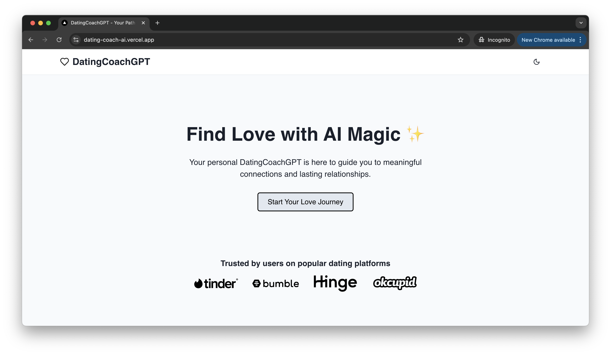
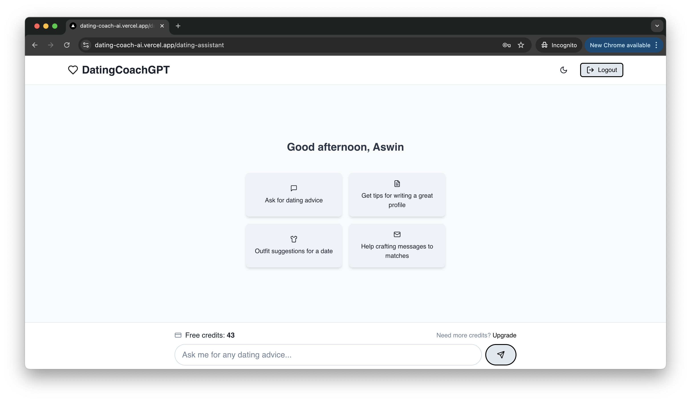
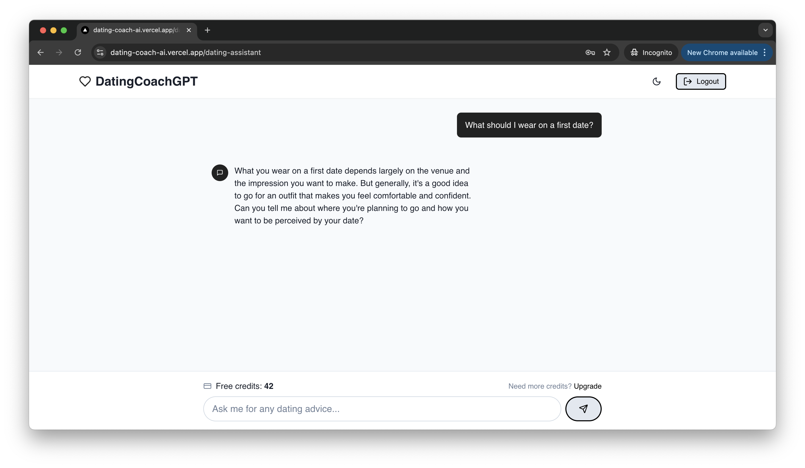

# DatingCoachGPT
An AI coach to help you with any questions you have about dating.

## Table of Contents
  - [Live Demo](#live-demo)
  - [Features](#features)
  - [Technologies Used](#technologies-used)
  - [Getting Started](#getting-started)
    - [Prerequisites](#prerequisites)
    - [Installation](#installation)
  - [Screenshots](#screenshots)
  - [How to use the application](#how-to-use-the-application)
  - [API Reference](#api-reference)
  - [Use Cases & Future Enhancements](#use-cases-and-future-enhancements)
  - [Contributing](#contributing)
  - [License](#license)
  - [Acknowledgments](#acknowledgments)
  - [FAQ](#faq)

## Live Demo

[https://DatingCoachGPT.vercel.app](https://DatingCoachGPT.vercel.app)

## Features

- User Authentication and Profile Management
- AI-Powered Dating Advice and Coaching
- Personalized Conversation Strategies
- Dating Profile Review and Optimization
- Real-time Feedback on Dating Scenarios

## Technologies Used

- Next.js for Frontend and Backend
- Chakra UI for Responsive Design
- OpenAI GPT-4 Model for AI-Powered Features
- MongoDB for Database Management
- Json Web Token for Authentication

## Getting Started

### Prerequisites

- Node.js (version 14 or later)
- MongoDB 
- OpenAI API key

### Installation

1. Clone the repository:
   ```
   git clone https://github.com/0xmetaschool/dating-coach-gpt
   cd dating-coach-gpt
   ```

2. Install dependencies:

   ```
   npm install
   ```

   This will install the following key dependencies:
   - next: React framework for production
   - react and react-dom: Core React libraries
   - @chakra-ui/react, @emotion/react, @emotion/styled, framer-motion: UI component library and its dependencies
   - axios: Promise-based HTTP client for making API requests
   - openai: OpenAI API client for Node.js
   - mongodb: MongoDB driver for Node.js
   - jsonwebtoken: JavaScript implementation of JSON Web Tokens
   - bcryptjs: Library for hashing passwords
   - react-icons: Icon library for React

3. Set up environment variables:
   - Create a `.env.local` file in the root directory
   - Add the following variables:
     ```
     MONGODB_URI=your_mongodb_connection_string
     JWT_SECRET=your_jwt_secret  
     OPENAI_API_KEY=your_openai_api_key
     ```

4. Start the development server:
   ```
   npm run dev
   ```

5. Open your browser and navigate to `http://localhost:3000`

## Screenshots

<div style="display: flex; justify-content: space-between;">
  
  
</div>

<div style="margin-top: 10px;">
  
</div>

## How to use the application

1. Getting Started with DatingCoachGPT:
   - Create a new account or sign in to your existing one
   - Complete your profile with accurate personal information
   - Add detailed descriptions of your interests, hobbies, and preferences

2. Maximizing Your Dating Success:
   - Use the app to get personalized advice on how to improve your dating game
   - Practice conversation scenarios with the app before real interactions
   - Get feedback on your dating profile and how to optimize it for better matches
   - Use the app to prepare for dates and improve your chances of success

## Use Cases & Future Enhancements

**Current Use Cases:**
- Get personalized dating advice and coaching
- Practice conversation skills with AI guidance
- Receive feedback on dating profiles
- Learn effective communication strategies
- Get help with specific dating scenarios and situations

**Coming Soon:**
- Real-time date coaching using real-time voice recognition
- AI-powered body language analysis via video dating
- Mock date simulations
- Dating profile writing assistance
- Cultural dating customs guidance

Want to contribute? Check out our contributing guidelines below!

## Contributing

We love contributions! Here's how you can help make the project even better:

- Fork the project (gh repo fork https://github.com/0xmetaschool/dating-coach-gpt.git)
- Create your feature branch (git checkout -b feature/AmazingFeature)
- Commit your changes (git commit -m 'Add some AmazingFeature')
- Push to the branch (git push origin feature/AmazingFeature)
- Open a Pull Request

## License

This project is licensed under the MIT License - see the [LICENSE](https://github.com/0xmetaschool/dating-coach-gpt/blob/main/LICENSE) file for details.

## Acknowledgments

- OpenAI for the GPT-4 API
- Chakra UI team for their React component library

## FAQ

**Q: Is DatingCoachGPT free to use?**
A: DatingCoachGPT offers both free and premium tiers. Basic matching and messaging are free, while advanced features require a subscription.

**Q: How does the AI matching work?**
A: Our AI analyzes profiles, interests, behavior patterns, and stated preferences to suggest compatible matches.

**Q: Is my data secure?**
A: Yes, we take data security and privacy very seriously. All user data is encrypted, and we never share your personal information with third parties.
